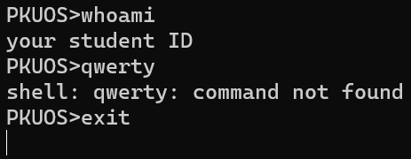

# Project 0: Getting Real

## Preliminaries

>Fill in your name and email address.


>If you have any preliminary comments on your submission, notes for the TAs, please give them here.


>Please cite any offline or online sources you consulted while preparing your submission, other than the Pintos documentation, course text, lecture notes, and course staff.


## Booting Pintos

>A1: Put the screenshot of Pintos running example here.


## Debugging

#### QUESTIONS: BIOS 

>B1: What is the first instruction that gets executed?

```ljmp   $0x3630,$0xf000e05b```


>B2: At which physical address is this instruction located?

```0xffff0```


#### QUESTIONS: BOOTLOADER

>B3: How does the bootloader read disk sectors? In particular, what BIOS interrupt is used?

在read_sector中进行一个中断调用，编号为```0x13```，参数为```0x42```。Extended read


>B4: How does the bootloader decides whether it successfully finds the Pintos kernel?

通过```cmpw $0xaa55, %es:510```判断MBR分区。之后通过判断```%es:(%si)```内容是否为零来找used partition，```cmpb $0x80, %es:(%si)```确认bootable，最后```cmpb $0x20, %es:4(%si)```来确认是否为kernel partition。


>B5: What happens when the bootloader could not find the Pintos kernel?

输出Not Found并触发```0x18```中断

>B6: At what point and how exactly does the bootloader transfer control to the Pintos kernel?

```assembly
mov $0x2000, %ax
mov %ax, %es
mov %es:0x18, %dx
mov %dx, start
movw $0x2000, start + 2
ljmp *start
```


#### QUESTIONS: KERNEL

>B7: At the entry of pintos_init(), what is the value of expression `init_page_dir[pd_no(ptov(0))]` in hexadecimal format?

```shell
(gdb) p init_page_dir[pd_no(ptov(0))]
=> 0xc000ef8f:  int3
=> 0xc000ef8f:  int3
$1 = 0
```

>B8: When `palloc_get_page()` is called for the first time,

>> B8.1 what does the call stack look like?

```shell
(gdb) bt
#0  palloc_get_page (flags=(PAL_ASSERT | PAL_ZERO)) at ../../threads/palloc.c:113
#1  0xc00203aa in paging_init () at ../../threads/init.c:168
#2  0xc002031b in pintos_init () at ../../threads/init.c:100
#3  0xc002013d in start () at ../../threads/start.S:180
```

>> B8.2 what is the return value in hexadecimal format?

```shell
(gdb) fin
Run till exit from #0  palloc_get_page (flags=(PAL_ASSERT | PAL_ZERO)) at ../../threads/palloc.c:113
=> 0xc00203aa <paging_init+17>: add    $0x10,%esp
0xc00203aa in paging_init () at ../../threads/init.c:168
Value returned is $3 = (void *) 0xc0101000
```

>> B8.3 what is the value of expression `init_page_dir[pd_no(ptov(0))]` in hexadecimal format?

```shell
(gdb) p/x init_page_dir[pd_no(ptov(0))]
=> 0xc000ef8f:  int3
=> 0xc000ef8f:  int3
$2 = 0x0
```


>B9: When palloc_get_page() is called for the third time,

>> B9.1 what does the call stack look like?

```shell
(gdb) bt
#0  palloc_get_page (flags=PAL_ZERO) at ../../threads/palloc.c:113
#1  0xc0020a81 in thread_create (name=0xc002e895 "idle", priority=0, function=0xc0020eb0 <idle>, aux=0xc000efbc) at ../../threads/thread.c:178
#2  0xc0020976 in thread_start () at ../../threads/thread.c:111
#3  0xc0020334 in pintos_init () at ../../threads/init.c:119
#4  0xc002013d in start () at ../../threads/start.S:180
```

>> B9.2 what is the return value in hexadecimal format?

```shell
(gdb) fin
Run till exit from #0  palloc_get_page (flags=PAL_ZERO) at ../../threads/palloc.c:113
=> 0xc0020a81 <thread_create+55>:       add    $0x10,%esp
0xc0020a81 in thread_create (name=0xc002e895 "idle", priority=0, function=0xc0020eb0 <idle>, aux=0xc000efbc) at ../../threads/thread.c:178
Value returned is $7 = (void *) 0xc0103000
```

>> B9.3 what is the value of expression `init_page_dir[pd_no(ptov(0))]` in hexadecimal format?

```shell
(gdb) p/x init_page_dir[pd_no(ptov(0))]
=> 0xc000ef4f:  int3
=> 0xc000ef4f:  int3
$8 = 0x102027
```


## Kernel Monitor

>C1: Put the screenshot of your kernel monitor running example here. (It should show how your kernel shell respond to `whoami`, `exit`, and `other input`.)



#### 

>C2: Explain how you read and write to the console for the kernel monitor.

读用```input_getc()```，写全用```printf()```。输入保存在buffer里，用for循环避免溢出。每读一个字符输出一个字符，检测到```\r```换行。换行后用```strcmp()```判断输入内容。